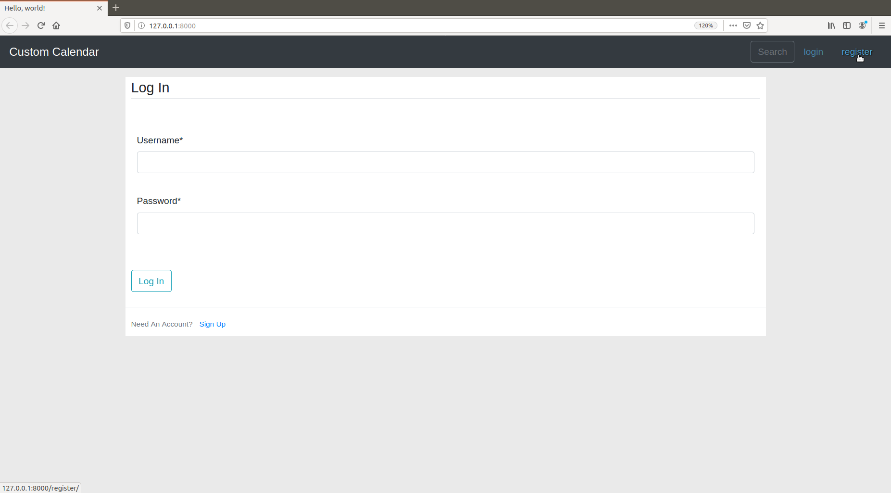
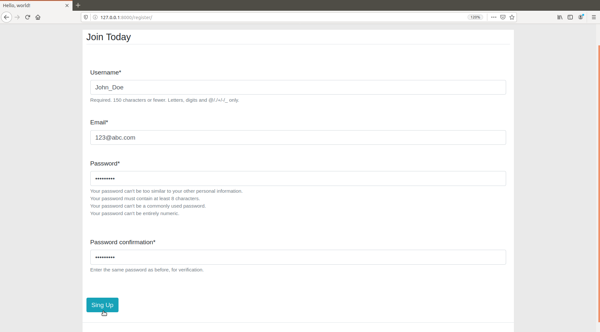
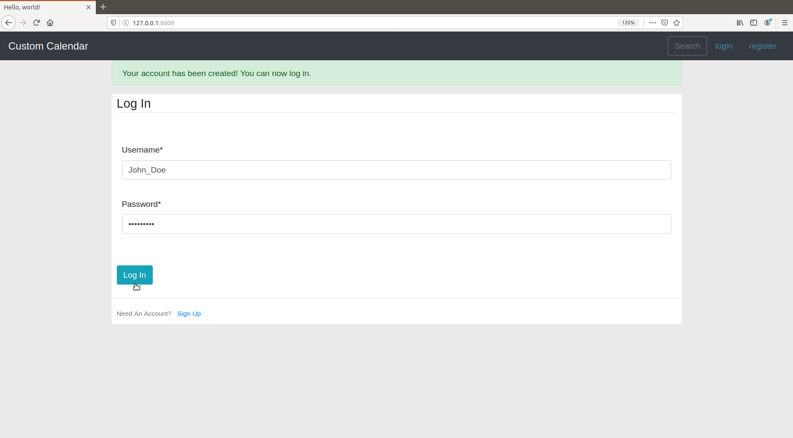
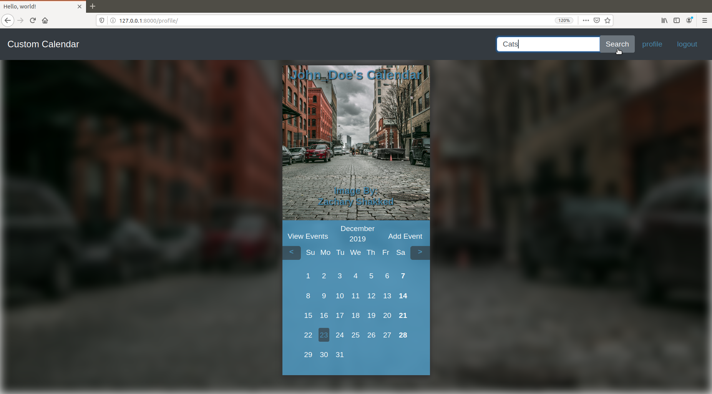
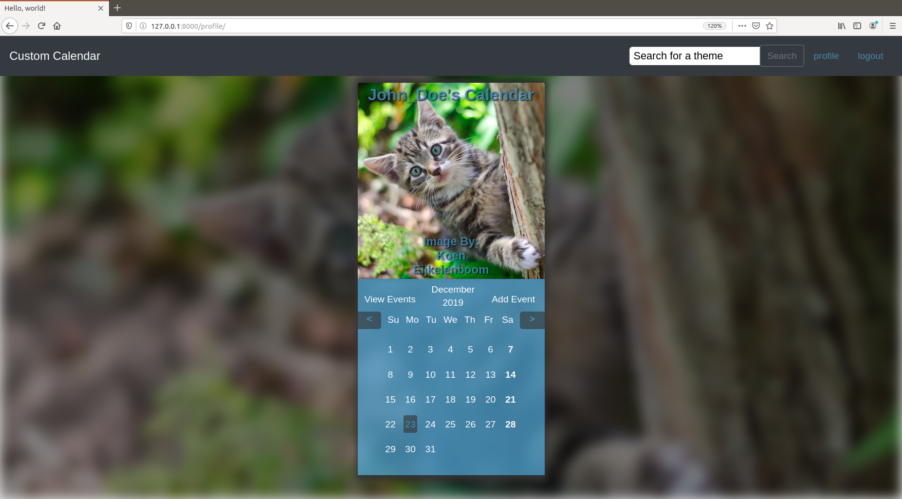
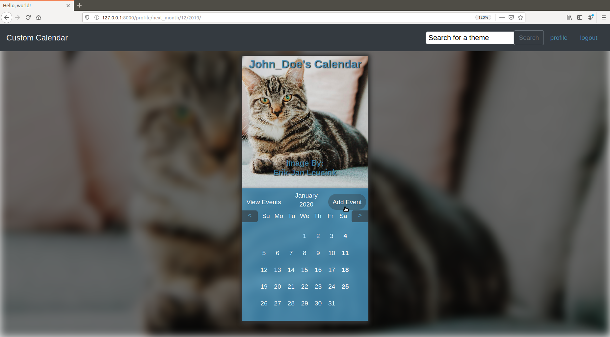
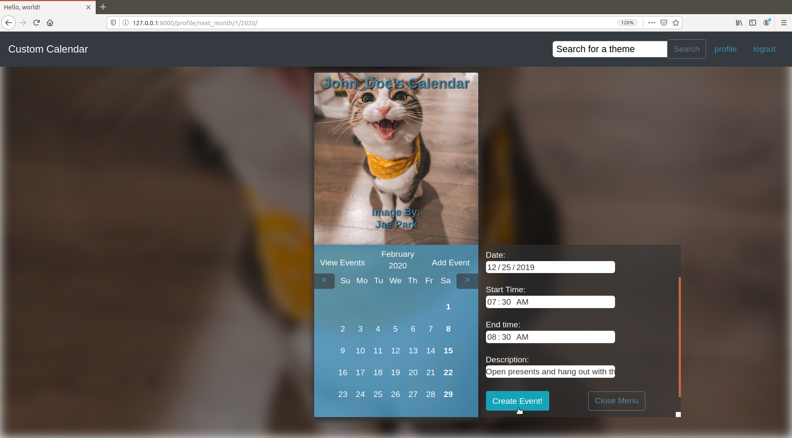
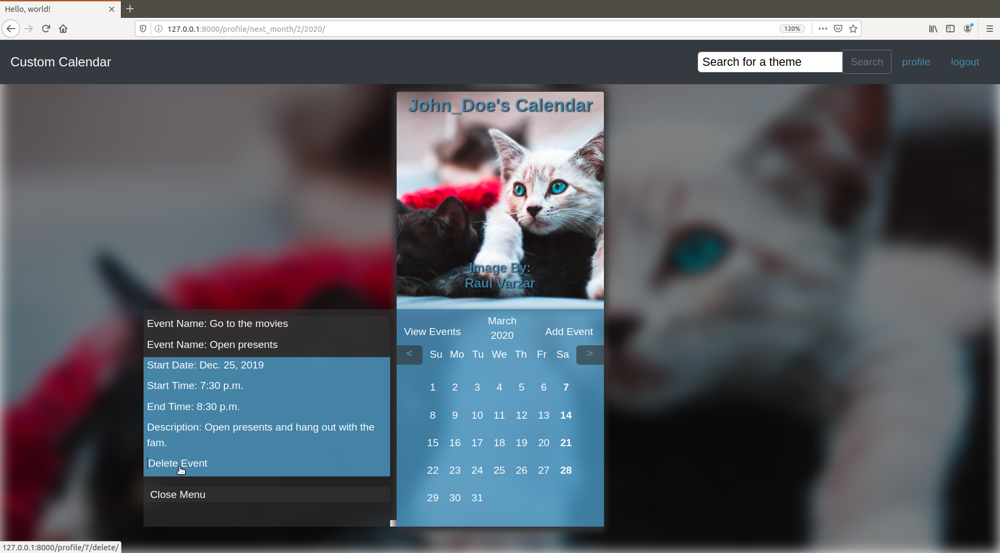

# Custom-Calendar

### Web application for generating calendars that fit any theme you want.
___
# Set-up
### 1) Clone the repo
### 2) pip install the requirements from requirements.txt.
### 3) While in the terminal, make sure you are in the same directory as manage.py. Run 'python manage.py createsuperuser'.
### 4) Follow the steps to create your admin profile.
### 5) Run the command 'python manage.py runserver' and open the link to your local host.
### *****Note: You will need your own secret key and API key*****
___
# How to use
### 1) If you already have a profile or just want to use the the admin profile, you can skip steps one and two.
### If do not have a profile, click 'register' in the top right corner to proceed to the register page.

---
### 2) Fill out the registration form and click 'Sign Up'. Note: You do not need to use an actual email address. This is only for password recovery which I have not set up yet.

---
### 3) Enter your credentials and click 'Log In' button.

---
### 4) Now that you're logged in, you can use the search bar to type in what theme you want. This uses Unsplash's API and will return 12 images that have tags that match the provided theme.

### The images will automatically be set to each month.

### 5) You can also set upcoming events by clicking 'Add Event' to open a menu containing a form.

### 6) Give the event a name, start date, start/end time, and a description. Then click 'Create Event'.

### 7) Now that you have your event, you can view it at any time by clicking 'View Events' and then clicking on the 'Event Name' to expand the event details.

___
## Additionally, if you like any images provided by this application, you can click on the author's name to be taken to their Unsplash profile.
